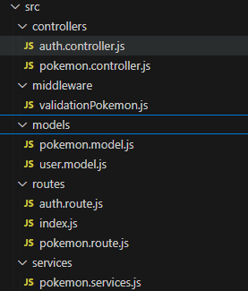

## Tabla de Contenido
- [Tabla de Contenido](#tabla-de-contenido)
  - [Información General](#información-general)
  - [Screenshot](#screenshot)
- [Tecnologías](#tecnologías)
- [Instalación](#instalación)
- [Colaboración](#colaboración)

### Información General
***
La siguiente APIResful conserva los principios de arquitectura del MVC, organizado dentro de la carpeta src



La APi Utiliza las siguientes librerias:

dotenv@16.4.7
joi@17.13.3
jsonwebtoken@9.0.2
node@22.12.0

Utiliza el siguiente Framework
express@4.21.1

### Screenshot


## Tecnologías
***
Se usaron las siguiente tecnologias en el proyecto:
* [Npm](https://www.npmjs.com/): Version 10.9.0
* [Vite](https://es.vitejs.dev/): Version 5.4.11
* [JavaScript](https://developer.mozilla.org/es/docs/Web/JavaScript): Version 10.9.0
* [HTML](https://developer.mozilla.org/es/docs/Web/HTML): Version HTML5
* [CSS](https://developer.mozilla.org/es/docs/Web/CSS): Version CSS3
## Instalación
***
 
```

$ cd ../path/to/the/file
$ npm install dotenv
$ npm install node
$ npm install express
$ npm install joi@17.13.3
$ npm install jsonwebtoken


## Colaboración
***
Este proyecto fué posible gracias a las enseñanzas del Instituto Profesional San Sebastián de Chile